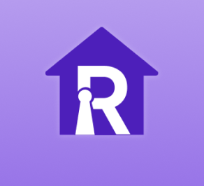
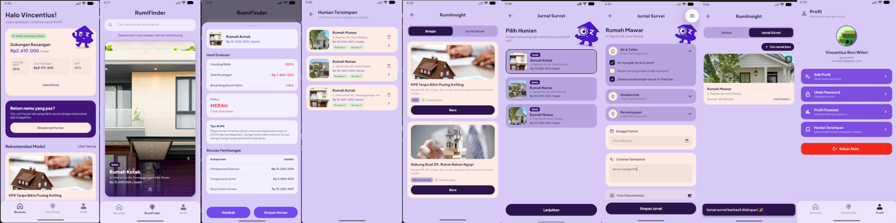

<div align="center">

  

  <p align="center">
    
  </p>

  # Rumi

  Pahami Perjalanannya, Temukan Tempat Tinggalmu: platform cerdas pencarian hunian terintegrasi dengan evaluasi kesehatan finansial.

  <br />

  
  
  
  

</div>

---

## Table of contents

- [Project overview](#project-overview)
- [Key features](#key-features)
- [Technology stack](#technology-stack)
- [Project structure](#project-structure)
- [Team](#team)

## Project overview

| Item | Details |
| --- | --- |
| Application Type | Mobile Application |
| Primary Platform | Cross-platform (Android & iOS) |

Rumi adalah aplikasi mobile pencarian dan evaluasi hunian cerdas yang membantu pengguna—khususnya dewasa muda usia 20-an yang sedang mencari hunian pertama—menemukan rumah sewa atau beli yang sesuai dengan kapasitas keuangan mereka, lewat perjalanan Learn → Discover → Evaluate → Inspect → Decide.

## Key features

| Feature | What the user can do |
| --- | --- |
| RumiInsight (Learn & Inspect) | Mempelajari konsep dasar properti & keuangan lewat modul micro-learning bertone santai, sekaligus menulis Jurnal Survei hasil kunjungan lokasi. |
| RUMIFinder (Discover) | Menjelajahi katalog hunian secara interaktif dengan swipe kanan untuk menyimpan dan swipe kiri untuk melewati, lengkap detail hunian. |
| Financial Breathing Room (Evaluate) | Menganalisis Housing Ratio, Sisa Keuangan Bulanan, dan Breathing Room Ratio secara otomatis terhadap harga hunian yang dipilih. |
| Financial Profile | Mengelola catatan pendapatan, pengeluaran rutin, dan dana darurat sebagai acuan kalkulasi otomatis di seluruh aplikasi. |
| Profile & Daftar Tersimpan (Decide) | Meninjau ulang seluruh hunian tersimpan beserta hasil evaluasi dan jurnal survei sebagai bahan keputusan akhir. |
| Authentication | Mendaftar akun baru, login terintegrasi backend, serta mengatur ulang kata sandi dengan alur yang aman. |

## Technology stack

| Category | Technology | Purpose |
| --- | --- | --- |
| Frontend | Flutter (Dart) | Framework utama pengembangan antarmuka aplikasi mobile multiplatform |
| State Management | StatefulBuilder / Built-in State | Manajemen status lokal, gesture interaktif, dan modal dinamis |
| Backend as a Service | Supabase | Layanan backend terkelola untuk autentikasi dan database realtime |
| Database | PostgreSQL (Supabase) | Penyimpanan data pengguna, profil finansial, dan properti |
| Authentication | Supabase Auth | Manajemen session, registrasi, dan login pengguna |
| UI & Assets | Google Fonts & Flutter SVG | Tipografi Plus Jakarta Sans dan rendering vektor maskot Rumi |

## Project structure

```text
lib/
├── core/                   # Utility inti, transisi halaman, dan route aplikasi
├── data/
│   ├── mock/               # Mock data properti hunian dan penyimpanan lokal
│   └── repositories/       # Integrasi database dan repository Supabase
├── presentation/
│   ├── screens/            # Layar antarmuka (Auth, Home, RumiFinder, Profile, Detail)
│   └── widgets/            # Reusable UI widgets dan kartu komponen
└── main.dart               # Entry point dan inisialisasi konfigurasi aplikasi
assets/                     # Images and other static assets
pubspec.yaml                # Project dependencies
```

## Getting Started

To get a local copy up and running, follow these simple steps.

### Prerequisites

*   Flutter SDK installed on your machine.
*   An editor like VS Code or Android Studio.

### Installation

1.  **Clone the repo**
    ```sh
    git clone https://github.com/revuriii99/rumi.git
    ```
2.  **Navigate to the project directory**
    ```sh
    cd rumi
    ```
3.  **Install dependencies**
    ```sh
    flutter pub get
    ```
4.  **Run the app**
    ```sh
    flutter run
    ```

---

## Team

| Name | Role | Responsibilities | Contact |
| --- | --- | --- | --- |
| Amelia Raisa | Product Manager | Merumuskan problem statement, solution, dan scope MVP, menyusun PRD & user flow, serta mengawasi timeline dan progres tim | LinkedIn |
| Salsabila | UI/UX Designer | Merancang design system, wireframe, dan prototype high-fidelity di Figma | LinkedIn |
| Scar | UI/UX Designer | Merancang design system, wireframe, dan prototype high-fidelity di Figma | LinkedIn |
| Vincent (Revi) | Mobile Engineer | Mengembangkan antarmuka aplikasi, integrasi fitur RUMIFinder, kalkulasi Financial Breathing Room, dan konektivitas Supabase | [GitHub](https://github.com/revuriii99) |